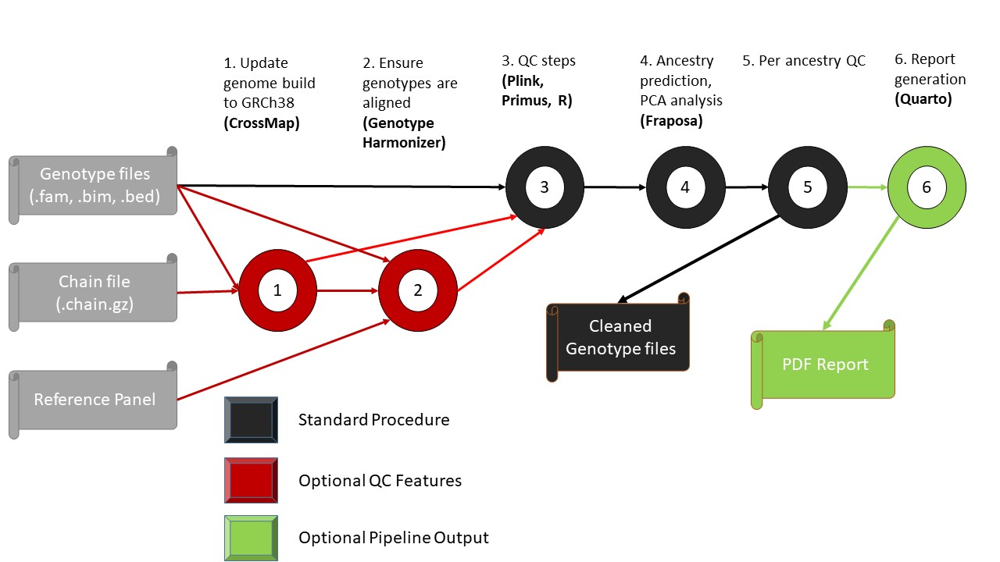

=====
Usage
=====

The **Genome-wide Data Cleaner (GDC)** is a comprehensive pipeline designed for cleaning genotype data and performing advanced genomic analyses. It integrates standard quality control procedures with optional advanced features like genome remapping and ancestry estimation.

Workflow Overview
-----------------

The pipeline processes input data through a structured sequence of stages:

   Overview of the GDC Genomics QC Pipeline stages.

1.  **Reference Update (Optional)**: Update genome builds from GRCh37 to GRCh38 using **CrossMap**.
2.  **Alignment (Optional)**: Ensure genotypes are aligned using **Genotype Harmonizer**.
3.  **Core QC Steps**: Execute standard quality control filters using **PLINK**, **Primus**, and **R**.
4.  **Ancestry & PCA**: Perform ancestry prediction and PCA analysis using **Fraposa**.
5.  **Per-Ancestry QC**: Refine results with specific QC filters based on predicted ancestry.
6.  **Reporting (Optional)**: Generate a final PDF report of all QC steps and changes via **Quarto**.

Running the Pipeline
--------------------

The pipeline is managed through a configuration file and executed via the ``Run.sh`` script.

Configuration File
~~~~~~~~~~~~~~~~~~

Before running the pipeline, ensure your ``config/config.yaml`` file is correctly configured with project-wide paths and tool-specific parameters. A typical configuration looks like this:

.. code-block:: yaml

    # Project-wide paths
    INPUT_FILE: "/projects/standard/gdc/public/Ref/toyData/1kgSynthetic"
    OUT_DIR: "/scratch.global/coffm049/toyPipeline"
    REF: "/projects/standard/gdc/public/Ref"

    # Tool-specific parameters
    relatedness:
        method: "0"
    SEX_CHECK: false
    RFMIX: true
    thin: true

You can find the template and additional parameters in the `official configuration file <https://github.com/UMN-GDC/GDCGenomicsQC/blob/ldPruning4PCA/config/config.yaml>`_.

Command-Line Flags
------------------

You can append the following flags to the run command to customize the execution:

* **--set_working_directory**: Provide the path where output files should be stored.
* **--input_directory**: Provide the path to the directory containing your ``.bim``, ``.bed``, and ``.fam`` data.
* **--input_file_name**: Provide the common prefix shared by your genotype files.
* **--path_to_github_repo**: Provide the local path to the GDCGenomicsQC pipeline repository.
* **--user_x500**: Provide your x500 email (e.g., ``samp213@umn.edu``) to receive updates regarding sbatch submissions.
* **--use_crossmap**: Enter '1' to update the reference genome build to GRCh38.
* **--use_genome_harmonizer**: Enter '1' to update strand alignment.
* **--use_king**: Enter '1' to utilize KING for relatedness estimation.
* **--use_rfmix**: Enter '1' to utilize RFMix for ancestry estimation.
* **--make_report**: Enter '1' to generate an automated report of the QC steps and changes.
* **--custom_qc**: Enter '1' to apply custom settings for marker and sample filtering.

High-Performance Computing (SLURM)
----------------------------------

For large datasets, the script can be executed via ``sbatch`` to leverage cluster resources:

.. code-block:: console

    $ sbatch ./GDCGenomicsQC/Run.sh --set_working_directory $PWD --input_directory ${PWD}/input_data --input_file_name study_stem
